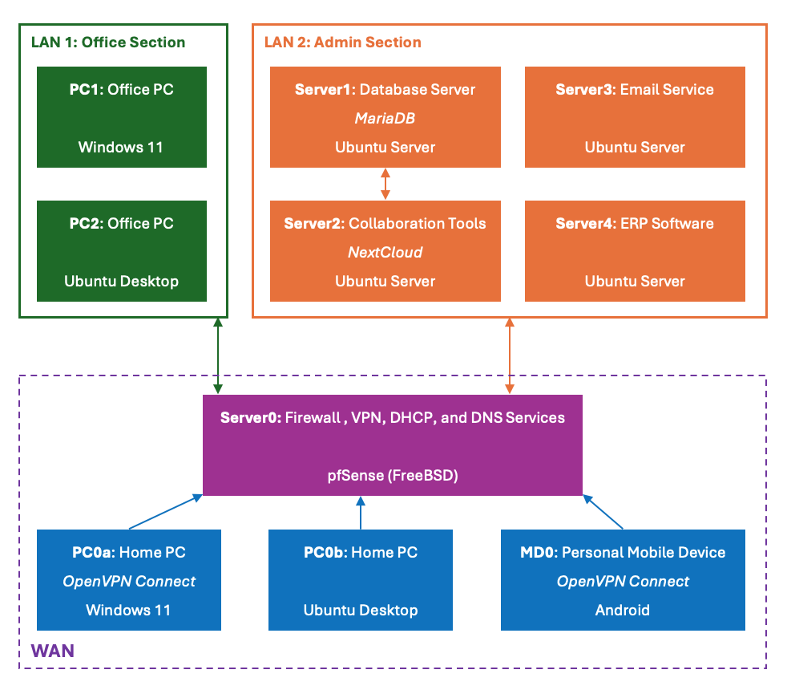

# SME IT Environment with IaC Tools
Automated provisioning of an SME IT Environment with Infrastrucure-as-Code tools!

*This is my playground for learning cloud infrastructure and IaC tools!*

This repo documents how to simulate an SME’s IT environment on a single machine.
First, we present how to manually set up such an IT environment.
Second, we describle how to VPN into this IT environment.
Lastly, we describe how to provision this IT environment with IaC tools.

## 1. Overview of the SME IT Environment
The IT environment of the simulated SME is shown in the following figure. Subnet 1 is for office use, serving office PCs, while subnet 2 is for administration and productivity services, serving servers like email, database and ERP software.

## 2. Setting up the SME IT Environment Manually

## 3. Accessing the SME IT Environment via VPN

## 4. Automated Provisioning of the SME IT Environment with IaC Tools

